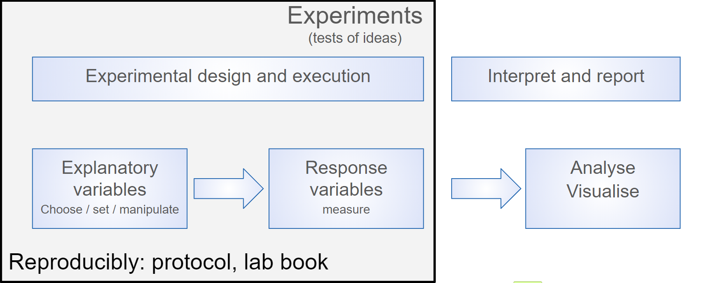
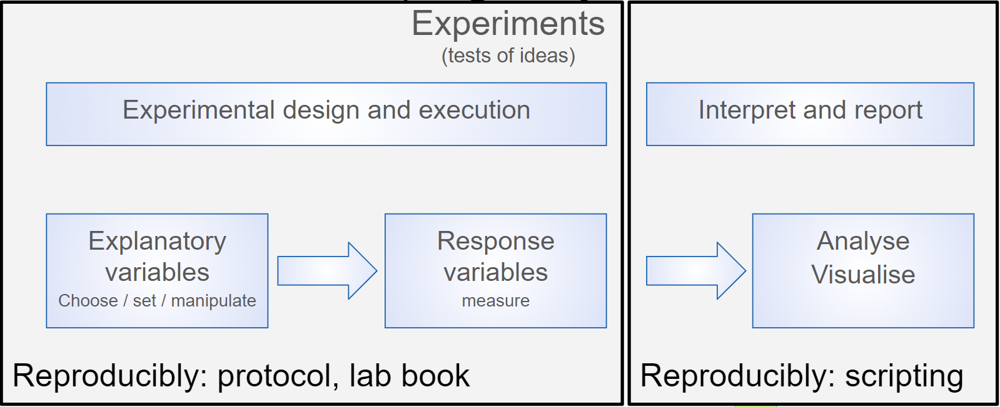

```{r setup, include=FALSE}
knitr::opts_chunk$set(echo = TRUE, 
                      message = FALSE,	
                      warning = FALSE,
                      fig.width = 4, 
                      fig.height = 4, 
                      fig.retina = 3)
options(htmltools.dir.version = FALSE)
```

```{r xaringanextra, echo=FALSE}
# scribble, toggle S, note cannot advance sides
xaringanExtra::use_scribble()
# copy code
xaringanExtra::use_clipboard()
# highlighted code
xaringanExtra::use_extra_styles(
  hover_code_line = TRUE,         
  mute_unhighlighted_code = TRUE)
```


```{r packages, include=FALSE}
library(RefManageR)
library(kableExtra)
library(tidyverse)
library(patchwork)
```


```{r, load-refs, include=FALSE, cache=FALSE}
BibOptions(check.entries = FALSE,
           bib.style = "authoryear",
           cite.style = "authoryear",
           style = "markdown",
           hyperlink = FALSE,
           dashed = FALSE,
           longnamesfirst = FALSE,
           max.names = 2)
myBib <- ReadBib("refs.bib", check = FALSE)
```


<style>
div.blue { background-color:#b0cdef; border-radius: 5px; padding: 20px;}
div.grey { background-color:#d3d3d3; border-radius: 0px; padding: 0px;}
</style>


---

class: inverse

# Programme Overview

---

# What this training *is* and *is not*

Chosen topics are: foundational, widely applicable, and transferable conceptually.


.pull-left[

.font90[

**It is**
* An introduction to R for those without previous experience
* About using RStudio projects and good practice for code and project documentation and organisation
* An introduction to the tidyverse, RMarkdown, some more advanced data import
 

]

]

--

.pull-right[

.font90[

**It is not**
* An introduction to statistics  
* Magic  

]

]

---
# Programme overview

Modules, tutor-led or supported study. The selection of modules you undertake will depend on your previous experience.

.font60[

[1. Introduction and Principles of reproducibility](01_intro_and_principles_of_repro.html)  
Audience: Everyone
* Rationale for scripting  
* Why R?  


[2. A. Introduction to R and working with data](02_intro_to_r_and_working_with_data.html)  

Audience: Those without previous experience of R
* Finding your way round RStudio  
* Typing in data, doing some calculations on it, plotting it  
* Understanding the manual  
* Importing data: working directories and paths  
* Summarising and visualising with the [`tidyverse`](https://www.tidyverse.org/)  
* Installing and loading packages  

]

---
# Have experience?

.font60[

[2. B. Tidying data and the tidyverse including the pipe](04_tidying_data_and_the_tidyverse.html)  
Audience: For those with previous experience of R but little of 'tidy data' and the tidyverse
* Using the tidyverse including the pipe to link operations together.  
* Carrying out some common data tidying tasks such as reshaping, renaming and recoding variable and cleaning cell contents  


[2. C. Advanced data import](05_advanced_data_import.html)  
Audience: For those with previous experience of R and the tidyverse including the pipe. 
* Understanding what matters in data import  
* Importing plain text and proprietary data formats stored locally and on the web  
* Carrying out some simple web scraping  
* Packages available for importing publicly accessible data from APIs  
]


---
# Programme overview

.font60[

[3. RStudio Projects](03_rstudio_projects.html)  
Audience: Those without experience of RStudio projects
* Organising your work in a logical, consistent and reproducible way using RStudio Projects  
* Organisation of data  
* Organisation of analyses  
* Writing code with relative paths given appropriate to your project organisation  
* Writing dataframes and figures to file  

[4. R Markdown for Reproducible Reports](06_r_markdown_for_reproducible_reports.html)  
Audience: For those with previous experience of R such as having done "Introduction to R and working with data."
* Making more advanced figures  
* Creating reproducible reports in a variety of output formats.  

]


---
class: inverse

# Data analysis


---
# Data analysis

Mainly isn't statistics. ~80% of your time on getting data, cleaning data, aggregating data, reshaping data, and exploring data using exploratory data analysis and data visualization.


---
# Reproducibility is key!

```{r turing-reprod-matrix, echo = FALSE, out.width="700px"}
knitr::include_graphics("pics/reproducible-matrix.jpg")
```

.font60[
How the Turing Way `r Cite(myBib, "the_turing_way_community_2019_3233986")` defines reproducible research
]


---
# Who cares?

* Many high profile cases of work which did not reproduce e.g. Anil Potti unravelled by `r Citet(myBib, "Baggerly2009-pw")` 

* Five selfish reasons to work reproducibly `r Cite(myBib, "Markowetz2015")`. Alternatively, see the [talk](https://youtu.be/yVT07Sukv9Q)


* **Will** become standard in Science and publishing e.g OECD Global Science Forum Building digital workforce capacity and skills for data-intensive science `r Cite(myBib, "OECD_Global_Science_Forum2020-cp")`

---
class: inverse

# Rationale for scripting analysis


---
# Rationale for scripting analysis
Science is the generation of ideas, designing work to test them and reporting the results.

```{r echo = FALSE, out.width="600px"}
knitr::include_graphics("pics/rationale1.png")
```

.pull-left[
Generating the results
]

.pull-right[
Analysing and reporting them
]
---

# Rationale for scripting analysis
We ensure reproducibility of laboratory and field work by planning and recording in lab books and using standard protocols. 


```{r echo = FALSE, out.width="600px"}

```

Even so replicating results can be hard.
---

# Rationale for scripting analysis
We ensure reproducibility of laboratory and field work by planning and recording in lab books and using standard protocols. 

```{r echo = FALSE, out.width="600px"}

```


Workflows for computational projects and the data analysis and reporting of other work can, and should, be 100% reproducible! Scripting is the way to achieve this.

---
class: inverse

# Why R?


---
# Why R?

Open source and free

--
 .......But so is Python
  
--

R has reputation for catering to users who do not see themselves as programmers, and  allowing them to slide gradually into programming.


--

Designed for data analysis and graphics - which means it is often easier to achieve those tasks in R than a general purpose programming language.

---
# Why R?

The R community is one of R's greatest assets, being vibrant, inclusive and supportive of users at all levels.

.pull-left[
* [#rstats](https://twitter.com/hashtag/rstats?lang=en) on twitter is very active
* [RForwards](https://forwards.github.io/about/) the widening participation task force <sup>1</sup>
* [RLadies](https://rladies.org/) gender diversity promotion 
* [Hey! You there! You are welcome here](https://ropensci.org/blog/2017/06/23/community/)  

.font70[
.footnote[
1. I am member of the Core Team for Forwards
]
]

]

.pull-right[
```{r echo = FALSE, out.width="400px"}
knitr::include_graphics("pics/welcome_to_rstats_twitter.png")
```

.font70[
.footnote[
Artwork by @allison_horst 
]
]

]


---
class: inverse

# Aspects of Reproducibility

---
# Aspects of Reproducibility 

* Data within files should be 'tidy'
* Project based approach
* Consistency: naming, space, style   
* Documentation: commenting and README  
* Literate programming e.g. Rmarkdown  


---
# Further Reading

* "Ten simple rules for reproducible computational research" `r Cite(myBib, "Sandve2013-nd")`  
* "Best practices for scientific computing" `r Cite(myBib, "Wilson2014-ij")`  
* "Good enough practices in scientific computing" `r Cite(myBib, "Wilson2017-cp")`  
* "Excuse Me, Do You Have a Moment to Talk About Version Control?" `r Cite(myBib, "Bryan2018-hl")`  

---
# Summary

* The course is:
  * an introduction to reproducible analyses rather than statistics  
  * not enough, you need to practice!  
  * comprised of modules so you can opt out where you already have the skills  
* Scripting makes your work reproducible  
* Focus is on R but principles of reproducibility are widely applicable; use Python if you prefer  

---
# References
.footnote[
.font60[
Slides made with with xaringan `r Cite(myBib, "xaringan")` and xaringanExtra `r Cite(myBib, "xaringanExtra")`
]
]
.font60[
```{r refs, echo=FALSE, results="asis"}
PrintBibliography(myBib)
```
]

---
# Intro to Repro in R

Emma Rand  
[emma.rand@york.ac.uk](mailto:emma.rand@york.ac.uk)  
Twitter: [@er13_r](https://twitter.com/er13_r)   
GitHub: [3mmaRand](https://github.com/3mmaRand)  
blog: https://buzzrbeeline.blog/  

<a rel="license" href="http://creativecommons.org/licenses/by-nc-sa/4.0/"></a><br /><span xmlns:dct="http://purl.org/dc/terms/" property="dct:title">Licensed under a <a rel="license" href="http://creativecommons.org/licenses/by-nc-sa/4.0/">Creative Commons Attribution-NonCommercial-ShareAlike 4.0 International License</a>.

Rand, E. (2023). White Rose BBSRC DTP Training: An Introduction to Reproducible Analyses in R (Version v1.2). https://doi.org/10.5281/zenodo.3859818