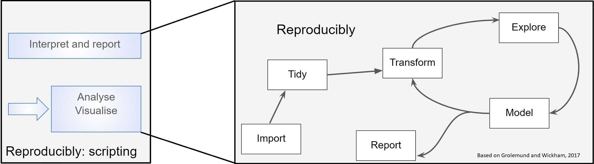

```{r setup, include=FALSE}
knitr::opts_chunk$set(echo = TRUE, 
                      message = FALSE,	
                      warning = FALSE,
                      fig.width = 4, 
                      fig.height = 4, 
                      fig.retina = 3)
options(htmltools.dir.version = FALSE)
```

```{r xaringanextra, echo=FALSE}
# tile view
xaringanExtra::use_tile_view()
# share
xaringanExtra::style_share_again(
  share_buttons = "all")
# broadcast: press P to enter the presenter view. Click on the Broadcast button to start broadcasting. Broadcast button will turn into a broadcast link. Share this link with your audience. When they open the link, their browser will connect with yours and from then on, whenever you advance or change slides, your viewer’s slides will move to the current slide.
# Note that the broadcast link is unique and, as the presenter, is remembered for 4 hours. After 4 hours of inactivity, a new link will be generated..
xaringanExtra::use_broadcast()
# scribble, toggle S, note cannot advance sides
xaringanExtra::use_scribble()
# copy code
xaringanExtra::use_clipboard()
# highlighted code
xaringanExtra::use_extra_styles(
  hover_code_line = TRUE,         
  mute_unhighlighted_code = TRUE)
```


```{r packages, include=FALSE}
library(RefManageR)
library(kableExtra)
library(tidyverse)
library(googlesheets4)
library(showtext)
library(patchwork)
```


```{r, load-refs, include=FALSE, cache=FALSE}
BibOptions(check.entries = FALSE,
           bib.style = "authoryear",
           cite.style = "authoryear",
           style = "markdown",
           hyperlink = TRUE,
           dashed = FALSE,
           longnamesfirst = FALSE,
           max.names = 2)
myBib <- ReadBib("../refs.bib", check = FALSE)
```

```{r fonts, include=FALSE}
font_add_google("Gochi Hand", "Gochi Hand")
showtext_auto()
```

<style>
div.blue { background-color:#b0cdef; border-radius: 5px; padding: 20px;}
div.grey { background-color:#d3d3d3; border-radius: 0px; padding: 0px;}
</style>


---
class: inverse

# Programme Overview

---

# What this training *is* and *is not*

Chosen topics are: foundational, widely applicable, and transferable conceptually.


.pull-left[

.font90[

**It is**
* An introduction to R for those without previous experience
* About using RStudio projects and good practice for code and project documentation and organisation
* An introduction to the tidyverse, RMarkdown, some more advanced data import
 

]

]

--

.pull-right[

.font90[

**It is not**
* An introduction to statistics  
* Magic  

]

]
---
# Programme overview

Modules lasting from 30 minutes to 2 hours. The selection of modules you undertake will depend on your previous experience.

.font60[

[1. Introduction and Principles of reproducibility](01_intro_and_principles_of_repro.html)  
Audience: Everyone
* Rationale for scripting  
* Why R?  
* Organisation of data  
* Organisation of analyses  

[2. Introduction to R and working with data](02_intro_to_r_and_working_with_data.html)  
Audience: Those without previous experience of R
* Finding your way round RStudio  
* Typing in data, doing some calculations on it, plotting it  
* Understanding the manual  
* Importing data: working directories and paths  
* Summarising and visualising with the [`tidyverse`](https://www.tidyverse.org/)  
* Installing and loading packages  

]

---
# Programme overview

.font60[

[3. RStudio Projects](03_rstudio_projects.html)  
Audience: Those without experience of RStudio projects
* Organising your work in a logical, consistent and reproducible way using RStudio Projects  
* Writing code with relative paths given appropriate to your project organisation  
* Writing dataframes and figures to file  

[4. Tidying data and the tidyverse including the pipe](04_tidying_data_and_the_tidyverse.html)  
Audience: For those with previous experience of R but little of 'tidy data' and the tidyverse, such as having done "Introduction to R and working with data."
* Using the tidyverse including the pipe to link operations together.  
* Carrying out some common data tidying tasks such as reshaping, renaming and recoding variable and cleaning cell contents  

]

---
# Programme overview

.font60[

[5. Advanced data import](05_advanced_data_import.html)  
Audience: For those with previous experience of R such as having done "Introduction to R and working with data" and "Tidying data and the tidyverse including the pipe."
* Understanding what matters in data import  
* Importing plain text and proprietary data formats stored locally and on the web  
* Carrying out some simple web scraping  
* Packages available for importing publicly accessible data from APIs  

[6. R Markdown for Reproducible Reports](06_r_markdown_for_reproducible_reports.html)  
Audience: For those with previous experience of R such as having done "Introduction to R and working with data."
* Making more advanced figures  
* Creating reproducible reports in a variety of output formats.  

]

---
class: inverse

# What is your previous experience? <br>Survey Results


---
# Survey results 1/3

```{r echo=FALSE}
# gs4_auth() run interactively
file <- "https://docs.google.com/spreadsheets/d/11Xx7FLNiure8jF-ti3DNKCj53j3eC8hgMYXA3crvT3I/edit#gid=184416414"
survey <- read_sheet(file) %>% 
  filter(Timestamp > "2020-12-31")

```
The distribution of ratings you (n = `r dim(survey)[1]`) gave in the survey were:
```{r echo=FALSE, fig.width = 12, fig.height=5}
r_exp <- survey %>%
  ggplot(aes(x = `Please rate your expertise in R`)) +
  geom_bar(fill = "#9d5e78") +
  scale_x_continuous(name = "Rating",
                     expand = c(0, 0),
                     breaks = 1:10,
                     limits = c(0, 10)) +
  scale_y_continuous(name = "Number of people",
                     expand = c(0, 0),
                     breaks = c(0, 5, 10, 15, 20, 25),
                     limits = c(0, 30)) +
  ggtitle("Rate your expertise in R") +
  theme_classic() +
  theme(plot.background = element_rect(fill = "#f6fafd"),
        panel.background = element_rect(fill = "#f6fafd"),
        plot.title = element_text(size = 35),
        axis.title = element_text(size = 25),
        axis.text.x = element_text(size = 25),
        axis.text.y = element_text(size = 25))


df <- survey %>% group_by(`Have you experience in any of the following programming languages. Tick all that apply.`) %>%  
  summarise(count = n())
lang <- df %>%
  ggplot(aes(x = reorder(`Have you experience in any of the following programming languages. Tick all that apply.`, count), y = count)) +
  geom_bar(fill = "#9d5e78", stat = "identity") +
  scale_x_discrete(name = "") +
  scale_y_continuous(name = "Number of people",
                     expand = c(0, 0),
                     breaks = c(0, 5, 10, 15, 20, 25),
                     limits = c(0, 30)) +
  ggtitle("Experience of other langauges") +
  theme_classic() +
  theme(plot.background = element_rect(fill = "#f6fafd"),
        panel.background = element_rect(fill = "#f6fafd"),
        plot.title = element_text(size = 35),
        axis.title = element_text(size = 25),
        axis.text.x = element_text(size = 25),
        axis.text.y = element_text(size = 25)) +
  coord_flip()


lang_exp <- survey %>%
  ggplot(aes(x = `Please rate your expertise in the non-R language you consider yourself most competent.`)) +
  geom_bar(fill = "#9d5e78") +
  scale_x_continuous(name = "Rating",
                     expand = c(0, 0),
                     breaks = 1:10,
                     limits = c(0, 10)) +
  scale_y_continuous(name = "Number of people",
                     expand = c(0, 0),
                     breaks = c(0, 5, 10, 15, 20, 25),
                     limits = c(0, 30)) +
  ggtitle("Rate your expertise in\nnon-R language") +
  theme_classic() +
  theme(plot.background = element_rect(fill = "#f6fafd"),
        panel.background = element_rect(fill = "#f6fafd"),
        plot.title = element_text(size = 35),
        axis.title = element_text(size = 25),
        axis.text.x = element_text(size = 25),
        axis.text.y = element_text(size = 25))

r_exp + lang + lang_exp &
  plot_annotation(theme = theme(plot.background = element_rect(fill = "#f6fafd")))

```

---
# Survey results 2/3

```{r echo=FALSE, fig.width = 12, fig.height=5}
df <- survey %>% group_by(`In what package/programme are you MOST likely to carry out data analysis and visualisation currently?`) %>%  
  summarise(count = n())
data_pkg <- df %>%
  ggplot(aes(x = reorder(`In what package/programme are you MOST likely to carry out data analysis and visualisation currently?`, count), y = count)) +
  geom_bar(fill = "#9d5e78", stat = "identity") +
  scale_x_discrete(name = "") +
  scale_y_continuous(name = "Number of people",
                     expand = c(0, 0),
                     breaks = c(0, 5, 10, 15, 20, 25),
                     limits = c(0, 30)) +
  ggtitle("Current Data Analysis package") +
  theme_classic() +
  theme(plot.background = element_rect(fill = "#f6fafd"),
        panel.background = element_rect(fill = "#f6fafd"),
        plot.title = element_text(size = 35),
        axis.title = element_text(size = 25),
        axis.text.x = element_text(size = 25),
        axis.text.y = element_text(size = 25)) +
  coord_flip()


df <- survey %>% group_by(`In what package/programme are you MOST likely to write up analysis results to submit to a journal or similar?`) %>%  
  summarise(count = n())
writing_pkg <- df %>%
  ggplot(aes(x = reorder(`In what package/programme are you MOST likely to write up analysis results to submit to a journal or similar?`, count), y = count)) +
  geom_bar(fill = "#9d5e78", stat = "identity") +
  scale_x_discrete(name = "") +
  scale_y_continuous(name = "Number of people",
                     expand = c(0, 0),
                     breaks = c(0, 10, 20, 30, 40),
                     limits = c(0, 50)) +
  ggtitle("Current writing package") +
  theme_classic() +
  theme(plot.background = element_rect(fill = "#f6fafd"),
        panel.background = element_rect(fill = "#f6fafd"),
        plot.title = element_text(size = 35),
        axis.title = element_text(size = 25),
        axis.text.x = element_text(size = 25),
        axis.text.y = element_text(size = 25)) +
  coord_flip()

data_pkg + writing_pkg &
  plot_annotation(theme = theme(plot.background = element_rect(fill = "#f6fafd")))
```


---
# Survey results 3/3
Please rate your level of comfort with...

```{r echo=FALSE, fig.width = 12, fig.height=7}
topics <- survey %>%
   select(starts_with("Please rate your level of comfort with the following in R")) %>%
   data.frame(.,check.names = FALSE)
names(topics) <- names(topics) %>%
  sub(pattern = "Please rate your level of comfort with the following in R \\[*",
      replacement = "") %>%
  sub(pattern = "\\]", replacement = "")
my_levels <- c("Not at all comfortable",
               "A bit uncomfortable",
               "Quite comfortable",
               "Completely comfortable")
topics1 <- topics %>% 
#   select(1:8) %>% 
   pivot_longer(names_to = "Topic",
                values_to = "Rating",
                cols = everything())
topics1$Rating <- factor(topics1$Rating, levels = my_levels)
topics1 %>% 
   ggplot(aes(x = Rating)) +
   geom_bar(fill = "#9d5e78") +
   scale_x_discrete(name = "") +
   scale_y_continuous(name = "Number of people",
                      expand = c(0, 0),
                      breaks = c(0, 10, 20, 30, 40, 50),
                      limits = c(0, 55)) +
    facet_wrap(.~ Topic, nrow = 4,  strip.position = "top",
              labeller = label_wrap_gen(width = 35)) + 
   coord_flip() +
   theme_classic() +
   theme(axis.title = element_text(size = 20),
         axis.text.x = element_text(size = 20),
         axis.text.y = element_text(size = 20),
         strip.text.x = element_text(size = 20, lineheight = 0.4,
                                     margin = margin(b = 0)),
         strip.background = element_rect(fill = "#f6fafd", colour = "#f6fafd"),
         plot.background = element_rect(fill = "#f6fafd"),
         panel.background = element_rect(fill = "#f6fafd"))
```

---
class: inverse

# Data analysis


---
# Data analysis

How much of data analysis is using statistics?

Less than you probably think

~80% of your time on getting data, cleaning data, aggregating data, reshaping data, and exploring data using exploratory data analysis and data visualization.


---
# Reproducibility is key!

One definition
*"... obtaining consistent results using the same input data; computational steps, methods, and code; and conditions of analysis. This definition is synonymous with “computational reproducibility"*. `r Cite(myBib, "National_Academies_of_Sciences_Engineering2019-sb")`

Also see National Science Foundation `r Cite(myBib, "K_Bollen2015-un")`


---
# Who cares?

* Many high profile cases of work which did not reproduce e.g. Anil Potti unravelled by `r Citet(myBib, "Baggerly2009-pw")` 

* Five selfish reasons to work reproducibly `r Cite(myBib, "Markowetz2015")`. Alternatively, see the [talk](https://youtu.be/yVT07Sukv9Q)


* Will become standard in Science and publishing e.g OECD Global Science Forum Building digital workforce capacity and skills for data-intensive science `r Cite(myBib, "OECD_Global_Science_Forum2020-cp")`

---
# Open Science

```{r foster-fig, echo = FALSE, out.width="700px"}
knitr::include_graphics("../pics/Foster.png")
```
.font60[
By Petr Knoth and Nancy Pontika - https://en.wikipedia.org/wiki/Open_science#/media/File:Os_taxonomy.png, CC BY 3.0, https://commons.wikimedia.org/w/index.php?curid=61125075

FAIR - Findable, Accessible, Interoperable, Reusable `r Cite(myBib, "Wilkinson2016-pu")`
]


---
class: inverse

# Rationale for scripting analysis


---
# Rationale for scripting analysis
Science is the generation of ideas, designing work to test them and reporting the results.

```{r echo = FALSE, out.width="600px"}
knitr::include_graphics("../pics/rationale1.png")
```

.pull-left[
Generating the results
]

.pull-right[
Analysing and reporting them
]
---

# Rationale for scripting analysis
We ensure reproducibility of laboratory and field work by planning and recording in lab books and using standard protocols. 


```{r echo = FALSE, out.width="600px"}
knitr::include_graphics("../pics/rationale2.png")
```

Even so replicating results can be hard.
---

# Rationale for scripting analysis
We ensure reproducibility of laboratory and field work by planning and recording in lab books and using standard protocols. 

```{r echo = FALSE, out.width="600px"}
knitr::include_graphics("../pics/rationale3.png")
```


Workflows for computational projects and the data analysis and reporting of other work can, and should, be 100% reproducible! Scripting is the way to achieve this.

---

# Rationale for scripting analysis

That reproducibility applies to all aspects of the data workflow.

```{r echo = FALSE, out.width="600px"}

```

--

From importing or collecting the data, processing it for analysis, building statistical models and communicating the methods and results.

--

These are usually iterative and that process of iteration (the development of the analysis) should also be captured.

---
class: inverse

# Why R?


---
# Why R?

Open source and free

--
 .......But so is Python
  
--

R has reputation for catering to users who do not see themselves as programmers, and  allowing them to slide gradually into programming.


--

Designed for data analysis and graphics - which means it is often easier to achieve those tasks in R than a general purpose programming language.

---
background-image: url(../pics/welcome_to_rstats_twitter.png)
background-position: 95% 75%
background-size: 350px
# Why R?

The R community is one of R's greatest assets, being vibrant, inclusive and supportive of users at all levels.

* [#rstats](https://twitter.com/hashtag/rstats?lang=en) on twitter is very active
* [RForwards](https://forwards.github.io/about/) the widening participation task force <sup>1</sup>
* [RLadies](https://rladies.org/) gender diversity promotion 
* [Hey! You there! You are welcome here](https://ropensci.org/blog/2017/06/23/community/)  

.font70[
.footnote[
Artwork by @allison_horst "welcome to rstats on twitter"
1. I am member of the Core Team for Forwards
]
]

---
background-image: url(../pics/rmarkdown_wizards.png)
background-position: 10% 60%
background-size: 450px
# Why R?

R Markdown is sometimes called R's "killer feature". Turns analyses into fully reproducible high quality reports, presentations and dashboards.

Can run Python and other languages in R Markdown documents

.font70[
.footnote[
Artwork by @allison_horst "Be an Rmarkdown knitting wizard."
]
]

---
class: inverse

# Aspects of Reproducibility

---
# Organisation of data 

Within files should be 'tidy'

Tidy data adhere to a consistent structure which makes it easier to manipulate, model and visualize them. 

1. Each variable has its own column.  
2. Each observation has its own row.  
3. Each value has its own cell.  

Closely allied to the relational algebra of relational databases `r Cite(myBib, "Codd1990-th")`.  
Underlies the enforced rectangular formatting in SPSS, STATA and R's dataframe.  
The term 'tidy data' was popularised by `r Citet(myBib, "Wickham2014-nl")`.   
There may be more than one potential tidy structure.  

---
# Tidy format

```{r echo=FALSE}
pigeon <- read.table("../data/pigeon.txt", header = T)
```

Suppose we had just 3 individuals in each of two populations:

.pull-left[

**Not tidy**

```{r echo=FALSE}
knitr::kable(pigeon[1:3,], 
             format = "html")
```
]
```{r echo=FALSE}
pigeon2 <- gather(data = pigeon, 
                  key = population, 
                  value = distance)
```

.pull-right[

**Tidy!**
```{r echo=FALSE}
knitr::kable(head(pigeon2[c(1:3,41:43),]), 
             format = "html",
             row.names = FALSE)
```
]

---
# Organisation of analyses

* Project based approach, e.g., RStudio project or similar  
* directory structure 
* naming   
* commenting  
* readme  
* version control  

---
# Organisation of analyses

.pull-left[

**Directories**

* structured  
* systematic  
* repeatable  

**Naming**

* human and machine readable  
  * no spaces  
  * use snake/kebab case  
  * ordering: numbers (zero left padded), dates  
  * file extensions
]

.pull-right[
.code40[
```
-- stem_cell_rna_2019
   |__stem_cell_rna_2019.Rproj
   |__raw_ data
      |__2019-03-21_donor_1.csv
      |__2019-03-21_donor_2.csv
      |__2019-03-21_donor_3.csv
      |__2019-05-14_donor_1.csv
      |__2019-05-14_donor_2.csv
      |__2019-05-14_donor_3.csv
   |__processed_data
      |__all_long.txt
   |__figures
      |__01_volcano_donor_1_vs_donor_2.eps
      |__02_volcano_donor_1_vs_donor_3.eps
   |__functions
      |__01_file_import
      |__02_normalise.R
      |__theme_pca.R
      |__theme_volcano.R
   |__pics
      |__01_image.png
      |__01_image.png
   |__README.md
   |__refs
      |__r_refs.bib
      |__proj_refs.bib
   |__analyses
      |__01_data_processing.R
      |__02_exploratory.R
      |__03_modelling.R
      |__04_figures.R
      |__05_report.Rmd
```
]

]


---
# Organisation of analyses

## Further Reading

* "Ten simple rules for reproducible computational research" `r Cite(myBib, "Sandve2013-nd")`  
* "Best practices for scientific computing" `r Cite(myBib, "Wilson2014-ij")`  
* "Good enough practices in scientific computing" `r Cite(myBib, "Wilson2017-cp")`  
* "Excuse Me, Do You Have a Moment to Talk About Version Control?" `r Cite(myBib, "Bryan2018-hl")`  

---
# Summary

* The course is:
  * an introduction to reproducible analyses rather than statistics  
  * not enough, you need to practice!  
  * comprised of modules so you can opt out where you already have the skills  
* Scripting makes your work reproducible  
* Focus is on R but principles are widely applicable; use Python if you prefer  
* Recognising structure in your data and organising in 'tidy' format will pay dividends  
* The structured, systematic and consistent organisation of analyses will pay dividends


---
# References
.footnote[
.font60[
Slides made with with xaringan `r Cite(myBib, "xaringan")` and xaringanExtra `r Cite(myBib, "xaringanExtra")`
]
]
.font60[
```{r refs, echo=FALSE, results="asis"}
PrintBibliography(myBib, end = 7)
```
]

---
# References

.font60[
```{r refs2, echo=FALSE, results="asis"}
PrintBibliography(myBib, start = 8)
```
]
---
# Intro to Repro in R

Emma Rand  
[emma.rand@york.ac.uk](mailto:emma.rand@york.ac.uk)  
Twitter: [@er13_r](https://twitter.com/er13_r)   
GitHub: [3mmaRand](https://github.com/3mmaRand)  
blog: https://buzzrbeeline.blog/  

<a rel="license" href="http://creativecommons.org/licenses/by-nc-sa/4.0/"></a><br /><span xmlns:dct="http://purl.org/dc/terms/" property="dct:title">White Rose BBSRC Doctoral Training Partnership (DTP) in Mechanistic Biology Analytics 1: Introduction to reproducible analyses in R</span> by <span xmlns:cc="http://creativecommons.org/ns#" property="cc:attributionName">Emma Rand</span> is licensed under a <a rel="license" href="http://creativecommons.org/licenses/by-nc-sa/4.0/">Creative Commons Attribution-NonCommercial-ShareAlike 4.0 International License</a>.

