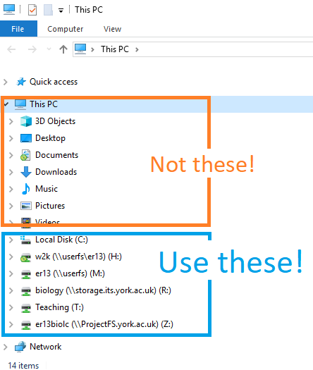

```{r setup, include=FALSE}
knitr::opts_chunk$set(echo = TRUE, 
                      message = FALSE,	
                      warning = FALSE,
                      fig.width=4, 
                      fig.height=4, 
                      fig.retina=3)
options(htmltools.dir.version = FALSE)
```

```{r packages, include=FALSE}
library(RefManageR)
library(kableExtra)
library(tidyverse)
```


```{r, load-refs, include=FALSE, cache=FALSE}
BibOptions(check.entries = FALSE,
           bib.style = "authoryear",
           cite.style = "authoryear",
           style = "markdown",
           hyperlink = TRUE,
           dashed = FALSE,
           longnamesfirst = FALSE,
           max.names = 2)
myBib <- ReadBib("../refs.bib", check = FALSE)
```


# Introduction

## Aims

The aim of this section is to show you how to organise your work in a logical, consistent and reproducible way using RStudio Projects, appropriate directory structures and portable code. It will set you up for the [Tidying data and the tidyverse including the pipe](04_tidying_data_and_the_tidyverse.html) and [Advanced Data Import](05_advanced_data_import.html) sections.

## Learning outcomes 

The successful student will be able to:

* understand what absolute and relative paths are
* use RStudio projects to appropriately organise a piece of work  
* write code with relative paths given appropriate to your project organisation  
* write dataframes and figures to file  

### `r emo::ji("clapper")` An instruction to do something!!

---

class: inverse

#  What is a path?


---
# What is a path?

A path gives the location of a filesystem object (i.e., a file, directory or link).

A path can be **absolute** or **relative**

--

## Absolute paths

An Absolute path is given from the root directory of the object. 

For example the absolute path for a file, `beewing.txt` can be:  
  * windows: `M:/web/58M_BDS_2019/data/beewing.txt`  <sup>1</sup>

.footnote[
1. this appears as `M:\web\58M_BDS_2019\data\beewing.txt` in Windows Explorer because Microsoft DOS didn't have directories in 1981 when it was released. It then used the `/` character for 'switches' (instead of the unix convention `-`)
]
--

  * unix systems: `/users/er13/web/58M_BDS_2019/data/beewing.txt`  
--

  * web: `http://www-users.york.ac.uk/~er13/58M_BDS_2019/data/beewing.txt`  

---
# What is a path?

## Relative paths

A relative path gives the location of a filesystem object relative to the working directory.

A working directory is where a program thinks you are and is returned by `getwd()` in R.

--

For example when `beewing.txt` is in:  
  * the working directory (wd):  `beewing.txt`  
--

  * a directory called 'data' which is in the wd: `data/beewing.txt`  
--

  * the directory above the wd: `../beewing.txt`  
--

  * a directory called 'data' which is in the directory above the wd: `../data/beewing.txt`  

---
# What is a path?


## Demonstration

```
-- thursday
   |__beewing.txt
   |__below_thursday
   |__data
      |__pigeon.txt
```


--

More if you need it: [What do we mean by paths?](https://youtu.be/oZblx36rqq0) 

---
class: inverse

#  Using RStudio projects


---
# Using RStudio projects


Using an [RStudio project](https://support.rstudio.com/hc/en-us/articles/200526207-Using-Projects) helps you manage file paths (amongst other things!). 

--

An Rstudio project is a directory with (at least) an .Rproj file in it. 

When you open a Project, the working directory is set to the project directory (i.e., the location of the .Rproj file). 

--

Read both of these instructions and the view the next slides before doing anything.


`r emo::ji("clapper")` Create a new project with File | New Project and chose New directory and then New project. I suggest naming it `wr_analytics` or similar.

`r emo::ji("clapper")` Be purposeful about where you create it by using the Browse button. Don't have `~` in the lower box! See next! 

---
# Using RStudio projects

## Don't have `~` in the lower box!
.pull-left[
....by navigating to your file store though the actual links starting `(\\userfs)(M:)` or similar not the shortcuts starting `This PC`:
]
.pull-right[

]

---
# Using RStudio projects

Creating a new project will:

1. Create a directory (folder) called `wr_analytics`
--

2. Restart RStudio in that directory and set your working directory to `wr_analytics` (i.e., it loads the project)
--

3. Create a `wr_analytics.Rproj` file within the project directory. This file contains various project options.  
--

4. Create a hidden directory (named .Rproj.user) where project-specific temporary files are stored.  

--

Note that `getwd()` will return `wr_analytics`

--

Suggested reading [Chapter 2 Project-oriented workflow](https://whattheyforgot.org/project-oriented-workflow.html) of What they forgot to teach you about R `r Cite(myBib, "Bryan-Hester")`

---
class: inverse

#  Suggested sensible directory structure


---
# Directory structure

`r emo::ji("clapper")` Create folders in `wr_analytics` called `raw_data`, `processed_data` and `figures`.

--

`r emo::ji("clapper")` Start new scripts called `tidy.R`, `import.R` and `figures.R`


---
class: inverse

#  Writing files

---
# Writing files

Often we want to write to files. 

My main reasons for doing so are to save copies of data that have been processed and to save manuscripts and graphics. 

--

You will import a simple data file, reshape the data and write it to file. You will also produce a simple figure and save that to file.

--

## Get ready 
`r emo::ji("clapper")` Load the tidyverse set of packages.
```{r eval=FALSE}
library(tidyverse)
```

---
# Writing files

## Import a datafile

`r emo::ji("clapper")` Save a copy of [pigeon.txt](raw_data/pigeon.txt) to your `raw_data` folder. These data give the interorbital distances for two populations of domestic pigeons.

--

`r emo::ji("clapper")` Using your `import.R` script, read in the file:

```{r}
pigeon <- read.table("raw_data/pigeon.txt", header = TRUE)
```

---
# Writing files

## Prepare some processed data

This dataset has two observations in a row - it is not 'tidy'. 

`r emo::ji("clapper")` Open your `tidy.R` script and reshape the data using:

```{r}
pigeon <- pivot_longer(data = pigeon, 
                       cols = everything(), 
                       names_to = "population", 
                       values_to = "distance")
```

---
# Writing files

## Write the processed data to file

`r emo::ji("clapper")` Write your dataframe called `pigeon` to a plain text file you will name `pigeon_long.txt` in your `processed_data` folder:
```{r}
file <- "processed_data/pigeon_long.txt"
write.table(pigeon, file)
```

--

Putting file paths into variables often makes you code easier to read especially when file paths are long or used multiple times.

---
# Writing files

## Create a plot to save

`r emo::ji("clapper")` Create a simple plot of this data:
.pull-left[
```{r} 
fig1 <- ggplot(data = pigeon, 
               aes(x = population, y = distance)) + 
  geom_boxplot() +                            
  scale_x_discrete(name = "Population") +
  scale_y_continuous(name = "Interorbital distance (mm)",
                     expand = c(0, 0),
                     limits = c(0, 15)) +
  theme_classic()
```
]
.pull-right[
```{r echo=FALSE} 
fig1
```

]

---
# Writing files

## Saving `ggplot` figures

A useful function for save figures is `ggsave()`. 

It has arguments for the size, resolution and device for the image. See the [`ggsave()` reference page](https://ggplot2.tidyverse.org/reference/ggsave.html). 

--

Since I often make more than one figure, I might set these arguments first.

`r emo::ji("clapper")` Assign `ggsave` argument values to variables:

```{r}
# figure saving settings
units <- "in"  
fig_w <- 3.2
fig_h <- fig_w
dpi <- 300
device <- "tiff" 
```

.footnote[
"tiff" is a format often required by journals; you may want png or jpg.]

---
# Writing files

## Saving `ggplot` figures

`r emo::ji("clapper")` Save the `figure` in your figures directory:

```{r eva}
ggsave("figures/fig1.tiff",
       plot = fig1,
       device = device,
       width = fig_w,
       height = fig_h,
       units = units,
       dpi = dpi)
```

---
# Summary

.font150[
* Organise your work in a logical, consistent and reproducible way using RStudio Projects and appropriate directory structure. 

* Make your code portable by using relative paths.

* Make your analysis comprehensible by breaking it down into different scripts and by using variables for repeatedly used or long values.

* You can write data and figures to file  
]
--

This session has set you up for the [Tidying data and the tidyverse including the pipe](04_tidying_data_and_the_tidyverse.html) and [Advanced Data Import](05_advanced_data_import.html) sections.

---
# References
.footnote[
Slides made with with xaringan `r Cite(myBib, "xaringan")`

]
```{r refs, echo=FALSE, results="asis"}
PrintBibliography(myBib)
```


---

class: inverse

# `r emo::ji("party")` Congratulations! Keep practising! `r emo::ji("party")` 

---
# Introduction to Reproducibility in R

## Emma Rand <br> [emma.rand@york.ac.uk](mailto:emma.rand@york.ac.uk) <br> Twitter: [@er13_r](https://twitter.com/er13_r) <br> GitHub: [3mmaRand](https://github.com/3mmaRand)  <br> blog: https://buzzrbeeline.blog/
<br>
<a rel="license" href="http://creativecommons.org/licenses/by-nc-sa/4.0/"></a><br /><span xmlns:dct="http://purl.org/dc/terms/" property="dct:title">White Rose BBSRC Doctoral Training Partnership (DTP) in Mechanistic Biology Analytics 1: Introduction to reproducible analyses in R</span> by <span xmlns:cc="http://creativecommons.org/ns#" property="cc:attributionName">Emma Rand</span> is licensed under a <a rel="license" href="http://creativecommons.org/licenses/by-nc-sa/4.0/">Creative Commons Attribution-NonCommercial-ShareAlike 4.0 International License</a>.


